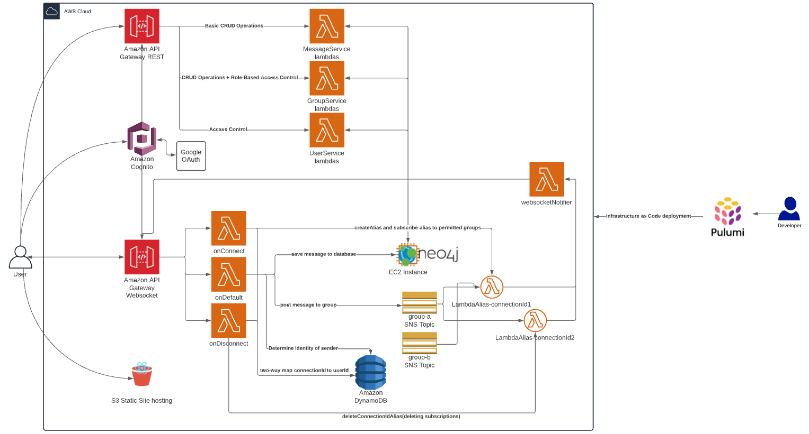

# Serverless Group Messaging Application
This contains the high level design overview of a serverless group messaging application.

## Overview
The application provides users with the ability to create private groups, apply to groups, reject users from groups, send real-time messages over websockets, reply to messages, log in to the application with their Google account.

## Architecture Diagram

## Backend Details
### Tech Stack
- Pulumi
- Typescript
- AWS Lambda/Node.js
- AWS EC2 for Neo4j
- Amazon S3
- Amazon DynamoDB
- Amazon SNS
- Amazon API Gateway
  - REST APIs
  - Serverless Websockets
- Amazon Cognito
- Google+ OAuth 2.0
- AWS IAM

### Neo4j database
Neo4j was used for its graph properties in order to easily store relations between classes of objects.
Designed the message graph as a tree with ordered children to provide pagination on forward and backward traversal on large reply threads.
Wrote transactional Cypher queries to prevent data-loss from parallel lambda executions.

### Serverless Real-time messaging
See architecture diagram or ask me. It's a thought provoking pattern around currying lambdas.

## Frontend Details
- Typescript
- React.js
- React Native
- Redux

## Previous Iterations
Prior I had written the application in Python with Terraform as my IaC provider and a MySQL database. I moved from MySQL to Elasticsearch and built a graph abstraction on top of it as a thought experiment, regretted it. Replaced Elasticsearch with Neo4j(a graph database). Added serverless websockets for real-time messaging. Terraform did not support API gateway serverless websockets at the time, boto3 also did not have complete documentation on use and was only saved by a [GitHub issue](https://github.com/boto/boto3/issues/1914). Used ElasticAPM to profile and optimize the message handler. Rewrote the handlers in Typescript because it allows for more straightforward concurrency and more easily mocking response objects Replaced my IaC with Pulumi. Replaced iterative message strategy with SNS fan-out type strategy and reduced latency from ~8 seconds to on the order of 200 ms when Lambda is hot.
